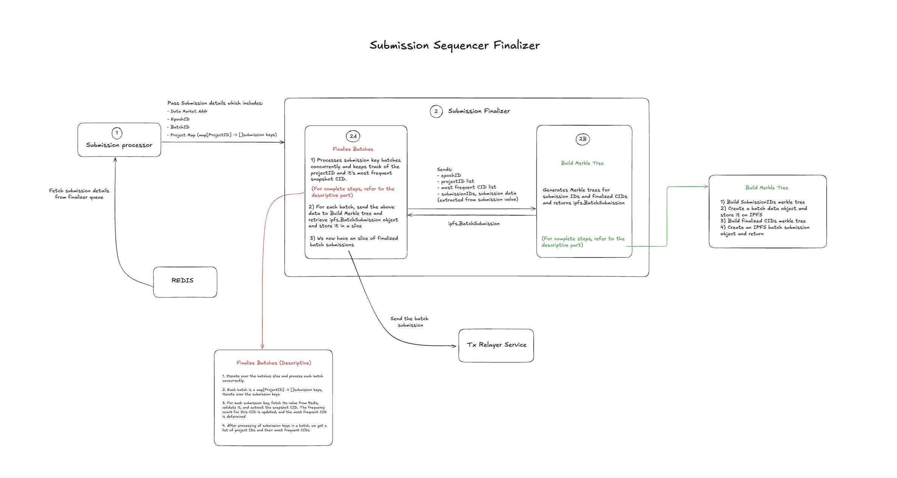

## Table of Contents
- [Table of Contents](#table-of-contents)
- [Overview](#overview)
- [Architecture](#architecture)
- [On-Chain updates](#on-chain-updates-via-relayer)
- [Find us](#find-us)

## Overview

The **Finalizer** plays a pivotal role within the **Submission Sequencer** system, serving as the last step in the batch processing pipeline. It is responsible for finalizing the batches prepared and forwarded by the Event Collector and subsequently submitting these finalized batches to the transaction relayer service.

Designed as an auto-scaled service, the Finalizer dynamically adjusts its capacity to handle fluctuating batch submission volumes, ensuring consistent performance and reliability.

Functionalities:

- **Process Submissions:** Retrieve submission details from the Finalizer Queue and initiate the finalization process.
- **Finalize Submissions:** Identify the most frequent SnapshotCID for each project in a batch and update the eligible submission counts for snapshotter identities matching the most frequent one.
- **Merkle Tree Construction:**
    - Generate a Merkle tree using the submission IDs from the batch.
    - Compute the root hash of the tree and construct a batch object.
    - Store the batch object on IPFS.
    - Create a second Merkle tree using the finalized CIDs to ensure data integrity and immutability.
    - Return the finalized IPFS batch submission data.
- **Finalized Batch Transmission:** Transmit the finalized IPFS batch submission data to the transaction relayer service.

## Architecture

The Finalizer is structured around three primary modules that collectively enable its functionality:

1. **Main Module(`cmd/main.go`)**:
   - This serves as the entry point for the Finalizer component, orchestrating key operations such as initializing interfaces, retrieving submission details and finalizing batch data.

2. **Configuration Module (`/config`)**:
   - The `/config` directory houses configuration files that define critical system parameters. These include client urls, contract addresses, timeout settings, authentication tokens, security parameters, and other project-specific configurations.

3. **Package Module (`/pkgs`)**:
   - The core event processing logic resides in the `/pkgs/batcher` directory. These modules manage submission detail retrieval, batch finalization, merkle tree construction, and other essential tasks, forming the foundation of the Finalizer's operations.

This modular design ensures a well-defined separation of responsibilities, with each module focusing exclusively on a distinct aspect of the system's functionality. By organizing the system into clearly delineated modules, each component can operate independently while contributing to the overall system architecture.

## On-Chain updates via Relayer
The Finalizer component leverages the relayer service to transmit essential updates to the Protocol State Contract, ensuring seamless synchronization across system components:

### Batch Processing Updates
- **Batch Submission:** Sends finalized IPFS batch submission data for each batch, corresponding to a specific data market and epoch combination, to the relayer for on-chain publishing.

## Find us

* [Discord](https://powerloom.io/discord)
* [Twitter](https://twitter.com/PowerLoomHQ)
* [Github](https://github.com/PowerLoom)
* [Careers](https://wellfound.com/company/powerloom/jobs)
* [Blog](https://blog.powerloom.io/)
* [Medium Engineering Blog](https://medium.com/powerloom)
